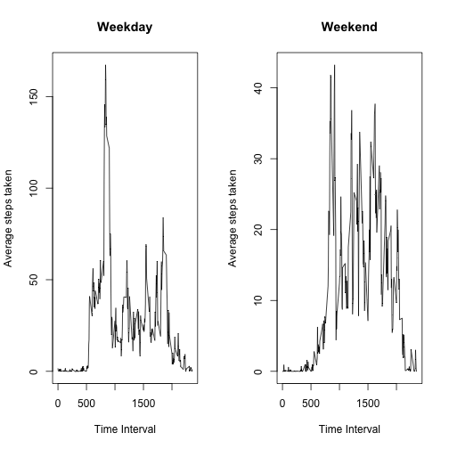

## Loading and preprocessing the data

**1) Code for reading in dataset**


```r
library(dplyr)
x <- read.csv("activity.csv")
```

## What is mean total number of steps taken per day?

**2) Code and histogram of total number of steps taken each day**

```r
by_date <- group_by(x,date)
step_total_by_date <- summarise(by_date, step_total = sum(steps))
hist(step_total_by_date$step_total,
     main = "Histogram of total number of steps taken each day",
     xlab = "Step Total",
     col = "royalblue")
```

 

**3) Code and results for the median number of steps taken each day**

Mean number of steps per day

```r
mean(step_total_by_date$step_total,na.rm = TRUE)
```

```
## [1] 10766.19
```

Median number of steps per day

```r
median(step_total_by_date$step_total,na.rm = TRUE)
```

```
## [1] 10765
```


## What is the average daily activity pattern?

**4) Code and time series plot of the average number of steps taken**

```r
by_interval <- group_by(x,interval)
step_total_by_interval <- summarise(by_interval, step_total = sum(steps,na.rm = TRUE))
step_total_by_interval_averages <- mutate(step_total_by_interval,
   step_average = step_total / length(step_total_by_date$date))
plot(step_total_by_interval_averages$interval,step_total_by_interval_averages$step_average, type = "l",
     main = "Average daily steps by 5 minute interval",
     xlab="Time Interval",
     ylab = "Average steps taken")
```

 

**5) The 5-minute interval with the maximum number of steps on average accross all days in the dataset is interval 835**


```r
filter(step_total_by_interval_averages, step_average == max(step_average))
```

```
## Source: local data frame [1 x 3]
## 
##   interval step_total step_average
## 1      835      10927     179.1311
```

## Imputing missing values

**6) Code to describe and show a strategy for inputing missing data**

The total number of missing step values:

```r
log_na <- is.na(x$steps)
sum(log_na)
```

```
## [1] 2304
```

All NAs in original dataset will be replaced with the average (across all days) step count for that interval


```r
## Create function to return the average step count for specified inteval
f <- function(df,i) {
  val <- df[df$interval==i,3]
  val$step_average
}

y <- x ## create copy of original dataset
for(i in 1:length(y$steps)){
  if(is.na(x$steps[i])==TRUE){ ## if value is NA replace with average
    val <- f(step_total_by_interval_averages,y$interval[i])
    y$steps[i] <- val
  }
}

by_date_imputed <- group_by(y,date)
step_total_by_date_imputed <- summarise(by_date_imputed, step_total = sum(steps))
```

**7) Histogram of the total number of steps taken each day after missing values are imputed**


```r
hist(step_total_by_date_imputed$step_total,
     main = "Histogram of total number of steps taken each day",
     xlab = "Step Total",
     col = "royalblue")
```

 

Mean number of steps per day

```r
mean(step_total_by_date_imputed$step_total,na.rm = TRUE)
```

```
## [1] 10581.01
```

Median number of steps per day

```r
median(step_total_by_date_imputed$step_total,na.rm = TRUE)
```

```
## [1] 10395
```

The values for mean and median are now lower after the missing step count values have been imputed. 


## Are there differences in activity patterns between weekdays and weekends?

**8) Panel plot comparing the average number of steps taken per 5-minute interval across weekdays and weekends**

First we create a new factor variable in dataset indicating wheter a given date is a weekday or weekend day

```r
daysofweek <- c("Monday","Tuesday","Wednesday","Thursday","Friday")

z <- mutate(y,week_or_weekend = ifelse(weekdays(as.Date(date, format = "%Y-%m-%d")) %in% daysofweek,"weekday","weekend"))
```


```r
## compute weekday interval averages
z_weekday <- z[z$week_or_weekend=="weekday",]
by_date_z_weekday <- group_by(z_weekday,date)
by_interval_z_weekday <- group_by(z_weekday,interval)
step_total_by_date_z_weekday <- summarise(by_date_z_weekday, step_total = sum(steps))
step_total_by_interval_z_weekday <- summarise(by_interval_z_weekday, step_total = sum(steps))

step_total_by_interval_averages_z_weekday <- mutate(step_total_by_interval_z_weekday,
step_average = step_total / length(step_total_by_date$date))

##compute weekend interval averages
z_weekend <- z[z$week_or_weekend=="weekend",]
by_date_z_weekend <- group_by(z_weekend,date)
by_interval_z_weekend <- group_by(z_weekend,interval)
step_total_by_date_z_weekend <- summarise(by_date_z_weekend, step_total = sum(steps))
step_total_by_interval_z_weekend <- summarise(by_interval_z_weekend, step_total = sum(steps))

step_total_by_interval_averages_z_weekend <- mutate(step_total_by_interval_z_weekend,
step_average = step_total / length(step_total_by_date$date))

par(mfrow=c(1,2))
plot(step_total_by_interval_averages_z_weekday$interval,step_total_by_interval_averages_z_weekday$step_average, type = "l",
     main = "Weekday",
     xlab="Time Interval",
     ylab = "Average steps taken")

plot(step_total_by_interval_averages_z_weekend$interval,step_total_by_interval_averages_z_weekend$step_average, type = "l",
     main = "Weekend",
     xlab="Time Interval",
     ylab = "Average steps taken")
```

 
